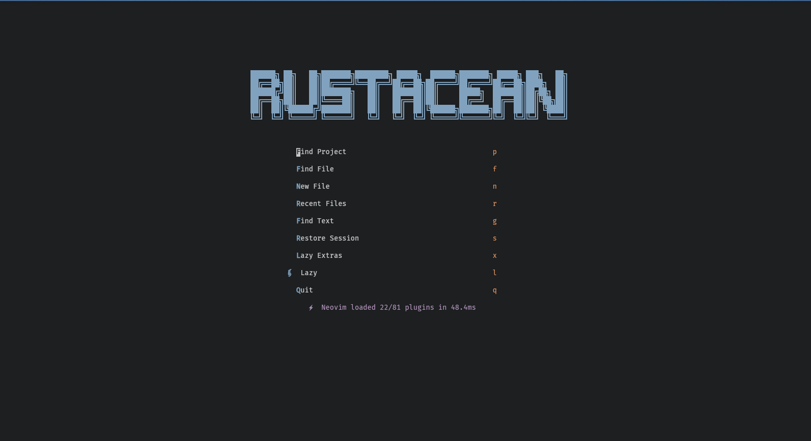

# Neovim Configuration

A highly customized [LazyVim](https://github.com/LazyVim/LazyVim) distribution with enhanced Rust development support, custom theming, and productivity-focused features.



## Features

- **Custom Theme System**: Tomorrow Night theme with multi-theme switcher (Carbonfox, OneDark, Catppuccin)
- **Rust Development**: Optimized setup with rustaceanvim, clippy integration, and custom target directory
- **Neovide Support**: Specialized configuration for Neovide GUI
- **Enhanced UI**: Custom dashboard, statusline with diagnostics and git integration, notification system
- **Git Integration**: Advanced git operations with SSH auth preservation
- **LSP & Completion**: Full language server support with auto-completion
- **Project Management**: Session persistence, project picker, and navigation tools

## Requirements

- Neovim >= 0.9.0
- Git >= 2.19.0
- A [Nerd Font](https://www.nerdfonts.com/) (optional, for icons)
- `ripgrep` for telescope searching
- `fd` for file finding
- For Rust: `rustup`, `rust-analyzer`, `rustfmt`

## Installation

1. Backup existing configuration:
```bash
mv ~/.config/nvim ~/.config/nvim.bak
```

2. Clone this configuration:
```bash
git clone <your-repo-url> ~/.config/nvim
```

3. Start Neovim:
```bash
nvim
```

LazyVim will automatically install all plugins on first launch.

## Structure

```
~/.config/nvim/
├── init.lua              # Entry point, Neovide config, SSH auth setup
├── lua/
│   ├── config/          # Core configuration
│   │   ├── autocmds.lua
│   │   ├── keymaps.lua
│   │   ├── lazy.lua     # Plugin manager setup
│   │   ├── neovide.lua  # Neovide-specific settings
│   │   └── options.lua
│   ├── plugins/         # Plugin configurations
│   │   ├── completion.lua
│   │   ├── editor.lua
│   │   ├── formatting.lua
│   │   ├── git.lua
│   │   ├── github.lua
│   │   ├── lsp.lua
│   │   ├── markdown.lua
│   │   ├── navigation.lua
│   │   ├── performance.lua
│   │   ├── productivity.lua
│   │   ├── project.lua
│   │   ├── rust.lua     # Rust-specific setup
│   │   ├── treesitter.lua
│   │   └── ui.lua       # Themes and UI components
│   └── tomorrow-night/  # Custom theme module
├── stylua.toml          # Lua formatting config
└── README.md
```

## Key Plugins

### UI & Appearance
- **noice.nvim**: Enhanced notifications and command-line UI
- **lualine.nvim**: Statusline with git diff, diagnostics, and time
- **dashboard-nvim**: Custom "RUSTACEAN" startup screen
- **indent-blankline.nvim**: Visual indent guides
- **nvim-scrollbar**: Scrollbar with search and diagnostic markers

### Editing & Navigation
- **neo-tree.nvim**: File explorer
- **telescope.nvim**: Fuzzy finder for files, grep, and more
- **flash.nvim**: Fast navigation and selection
- **mini.ai**: Enhanced text objects
- **persistence.nvim**: Session management

### Development
- **nvim-lspconfig**: LSP client configurations
- **rustaceanvim**: Advanced Rust development (replaces rust-tools)
- **conform.nvim**: Code formatting
- **nvim-cmp**: Auto-completion engine
- **nvim-treesitter**: Syntax highlighting and parsing

### Git
- **gitsigns.nvim**: Git decorations and inline blame
- **neogit**: Git interface
- **diffview.nvim**: Enhanced diff viewer

## Themes

Switch between themes using `<leader>ut`:

1. **Tomorrow Night** (Default) - Classic, balanced color scheme
2. **Carbonfox** - Dark, muted colors
3. **OneDark** - Classic Atom theme
4. **Catppuccin Mocha** - Soft, pastel-like colors

To manually load a theme:
```lua
-- Tomorrow Night
:lua require("tomorrow-night").load()

-- Others
:colorscheme carbonfox
:colorscheme onedark
:colorscheme catppuccin-mocha
```

## Rust Configuration

Optimized for Rust development with:
- **rustaceanvim** for advanced LSP features
- **Clippy** integration for linting
- Separate target directory (`target/rust-analyzer`) to avoid conflicts
- Custom keymaps:
  - `<leader>ca` - Code actions
  - `<leader>dr` - Debug runnables
  - `<leader>rr` - Run runnables
  - `<leader>re` - Expand macro
  - `<leader>rc` - Open Cargo.toml
  - `<leader>rp` - Parent module
  - `K` - Hover actions

## Neovide Configuration

Special optimizations when running in Neovide GUI (see `lua/config/neovide.lua`).

## Customization

- **Keymaps**: Edit `lua/config/keymaps.lua`
- **Options**: Edit `lua/config/options.lua`
- **Add plugins**: Create files in `lua/plugins/`
- **Theme colors**: Modify `lua/tomorrow-night/` or plugin configs in `lua/plugins/ui.lua`

## Git Workflow

SSH authentication is preserved for git operations. The configuration maintains your `SSH_AUTH_SOCK` environment variable across sessions.

## License

Personal configuration - use at your own discretion.

## Acknowledgments

Built on top of [LazyVim](https://github.com/LazyVim/LazyVim) by folke.
